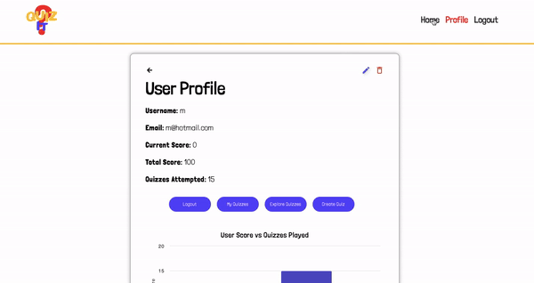

# QuizIt (Frontend)

QuizIt is a web application for quizzes built with React.

## Tech Stack

- React
- HTML/CSS
- JavaScript
- Reat Bootstrap
- React Router
- React Axios 
- React Highcharts
- React Websockets

## Features

### User Authentication
- Register: Users can create a new account to access the platform.
- Login: Existing users can log in to their accounts securely.

### Quiz Management
- Browse Quizzes: Users can browse through a list of available quizzes.
- Take Quizzes: Users can select and take quizzes from the available options.
- Create Quizzes (Admin): Admin users have the ability to create new quizzes.
- Edit Quizzes (Admin): Admin users can edit existing quizzes, including adding or removing questions.
- Delete Quizzes (Admin): Admin users can delete quizzes from the platform.

### Quiz Interaction
- Quiz Navigation: Users can navigate through quiz questions easily.
- Quiz Feedback: Users receive feedback on their quiz submissions, including correct and incorrect answers.
- Quiz Results: Users can view their quiz results, including scores and performance metrics.

### Responsive Design
- Mobile Compatibility: The application is responsive and works seamlessly across mobile and desktop devices.

## Installation

### Developer Environment

```bash
git clone <https://github.com/mashalnaeem/mashal-naeem-quizit-api>
cd <project-directory>
npm install
npm start
npm run build
```
### Production Environment

```bash
npm run build
```
## Screenshots




## Lessons Learned & Next Steps

During the development process, I encountered various challenges and learned valuable lessons. One of the challenges was implementing toggle dark mode and integrating web sockets for real-time multiplayer gaming features and broadcasting quizzes. Although I faced difficulties in these areas, it provided valuable learning experiences.

### Lessons Learned
- Importance of tackling challenges and exploring new technologies for enhancing user experience.
- Value of persistence and problem-solving skills in overcoming obstacles during development.

### Next Steps
Moving forward, the next steps for the frontend development include:
- Continuation of efforts to implement toggle dark mode functionality and integrate web sockets for real-time multiplayer gaming features and broadcasting quizzes.
- Deployment of the site to make it accessible to users.
- Continuous improvement and refinement of the user interface and overall user experience based on feedback and testing.

## Backend Repository

[Link to Backend Repository](<https://github.com/mashalnaeem/mashal-naeem-quizit-api>)


